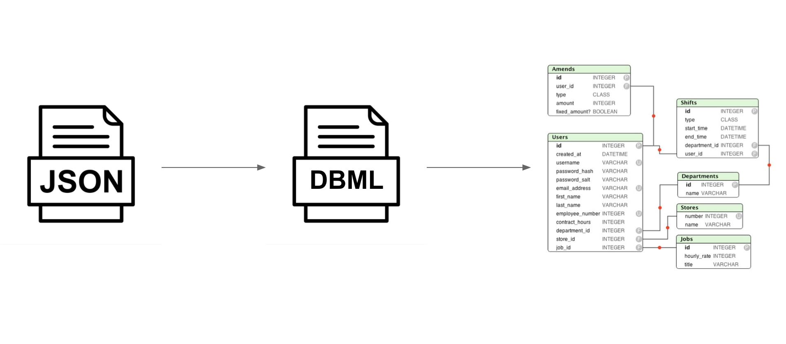
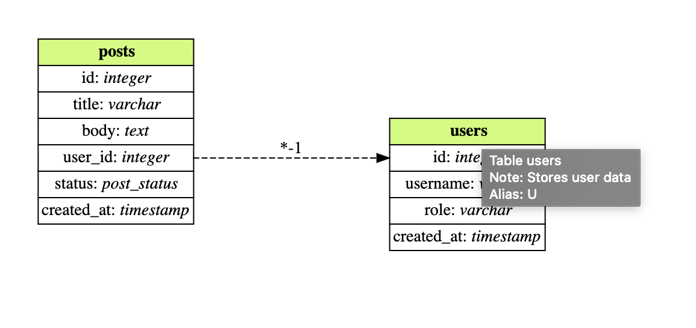

Render [Room](https://developer.android.com/topic/libraries/architecture/room) schemas into ER diagrams.

Once you have a JSON representation of your [Room exported schema](https://developer.android.com/training/data-storage/room/migrating-db-versions#export-schema), you can use `FloorPlan` to transform it into a DBML or DOT representation, or into SVG and PNG files, to then be checked back into the repository.

## Diagram rendering

FloorPlan supports rendering to multiple formats, including [SVG vectors](https://en.wikipedia.org/wiki/Scalable_Vector_Graphics), [PNG](https://en.wikipedia.org/wiki/Portable_Network_Graphics) and [DOT](https://www.graphviz.org/doc/info/lang.html), via its integration with the [GraphViz visualization library](https://www.graphviz.org/).

See an example of [Tivi's](https://github.com/chrisbanes/tivi)'s [schema (v26)](https://github.com/chrisbanes/tivi/blob/master/data-android/schemas/app.tivi.data.TiviRoomDatabase/26.json) when rendered into a SVG file:

### Diagram metadata

Some output formats allow for metadata to be attached to the ER diagram rendering. When outputting to SVG, FloorPlan will include supplementary information on entities, if available.

## [Database Markup Language (DBML)](https://www.dbml.org/home/).

**[DBML](https://www.dbml.org/home/) (Database Markup Language)** is an open-source DSL language designed to define and document database schemas and structures. It is designed to be simple, consistent and highly-readable.

FloorPlan provides a translation mechanism from the input database schemas into DBML, that can be later used for other interesting applications, like ER diagram rendering or in as an input for Pull Request revision on a development process.

#### DBML parser

With a few manual tweaks, DBML can also be used [directly as an input](https://github.com/julioz/FloorPlan/tree/master/dbml-parser) to the rendering mechanism, by skipping the pipeline's JSON-consumption step.

### [dbdiagram](https://dbdiagram.io/)

[dbdiagram](https://dbdiagram.io/) is a free, simple tool to draw ER diagrams, that can be used to render the DBML output of FloorPlan.

For instance, when translating [Tivi](https://github.com/chrisbanes/tivi)'s [schema (v26)](https://github.com/chrisbanes/tivi/blob/master/data-android/schemas/app.tivi.data.TiviRoomDatabase/26.json), this is the rendered output in dbdiagram:

!!! warning "Note"
    FloorPlan and its developers are in no way associated to dbdiagram.
